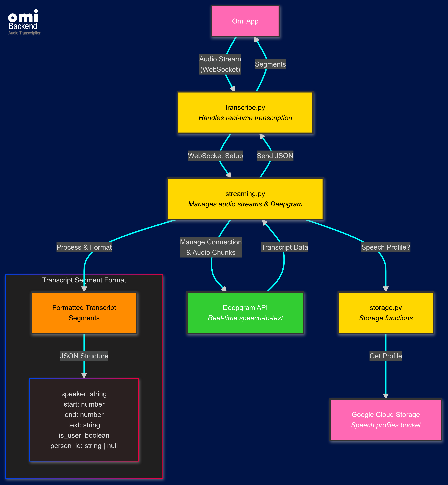

# 🎙️ Real-Time Transcription Process

This document provides a comprehensive overview of the real-time audio transcription process in the Omi application.



## 📡 Detailed Transcription Flow

Here's a detailed look at how the real-time transcription process works:

```mermaid
sequenceDiagram
    participant User
    participant OmiApp
    participant WebSocket
    participant TranscriptionServices
    participant VAD
    participant SpeakerIdentification
    participant MemoryProcessing
    
    User->>OmiApp: Start recording
    OmiApp->>WebSocket: Establish connection (/listen endpoint)
    WebSocket->>TranscriptionServices: Initialize Deepgram, Soniox, Speechmatics
    WebSocket->>VAD: Initialize Voice Activity Detection
    loop Audio Streaming
        OmiApp->>WebSocket: Stream audio chunks
        WebSocket->>VAD: Perform Voice Activity Detection
        VAD->>TranscriptionServices: Forward audio with speech
        TranscriptionServices->>WebSocket: Return real-time transcripts
        WebSocket->>OmiApp: Send live transcripts
    end
    User->>OmiApp: Stop recording
    OmiApp->>WebSocket: Close connection
    WebSocket->>SpeakerIdentification: Process final transcript
    SpeakerIdentification->>MemoryProcessing: Provide diarized transcript
    MemoryProcessing->>MemoryProcessing: Create processing memory
    MemoryProcessing->>OmiApp: Confirm memory creation
```

## 📡 Audio Streaming

1. The Omi App initiates a real-time audio stream to the backend.
2. Audio data is sent via WebSocket to the `/listen` endpoint.
3. Audio can be in Opus or Linear16 encoding, depending on device settings.

## 🔌 WebSocket Handling

### `/listen` Endpoint

- Located in `routers/transcribe.py`
- `websocket_endpoint` function sets up the connection
- Calls `_websocket_util` function to manage the connection

```python
@router.websocket("/listen")
async def websocket_endpoint(websocket: WebSocket, uid: str, language: str = 'en', ...):
    await websocket.accept()
    await _websocket_util(websocket, uid, language, ...)
```

### `_websocket_util` Function

- Accepts the WebSocket connection
- Checks for user speech profile
  - If exists, sends profile audio to Deepgram first
  - Uses `utils/other/storage.py` to retrieve profile from Google Cloud Storage
- Creates asynchronous tasks:
  - `receive_audio`: Receives audio chunks and sends to Deepgram
  - `send_heartbeat`: Sends periodic messages to keep connection alive

```python
async def _websocket_util(websocket: WebSocket, uid: str, language: str, ...):
    profile_audio = await get_profile_audio_if_exists(uid)
    
    receive_task = asyncio.create_task(receive_audio(websocket, uid, language, profile_audio, ...))
    heartbeat_task = asyncio.create_task(send_heartbeat(websocket))
    
    await asyncio.gather(receive_task, heartbeat_task)
```

## 🔊 Voice Activity Detection (VAD)

Before sending audio to transcription services, Omi uses Voice Activity Detection to identify speech segments:

- Utilizes pyannote.audio's pre-trained VAD model
- Runs on GPU if available, otherwise falls back to CPU
- Filters out non-speech audio to improve transcription accuracy and reduce processing load

```python
vad = Pipeline.from_pretrained(
    "pyannote/voice-activity-detection",
    use_auth_token=os.getenv('HUGGINGFACE_TOKEN')
).to(device)

def process_audio_with_vad(audio_chunk):
    vad_result = vad(audio_chunk)
    speech_segments = vad_result.get_timeline().support()
    return [segment for segment in speech_segments if segment.duration > 0.5]
```

## 🔊 Multiple Transcription Services Integration

### Deepgram Integration

- `process_audio_dg` function in `utils/stt/streaming.py` handles Deepgram transcription
- Initializes Deepgram client using `DEEPGRAM_API_KEY`
- Defines `on_message` callback for handling transcripts
- Starts live transcription stream with Deepgram

```python
async def process_audio_dg(uid: str, websocket: WebSocket, language: str, ...):
    client = deepgram.Deepgram(DEEPGRAM_API_KEY)
    
    async def on_message(result):
        # Process and send transcript back to client
        await websocket.send_json(process_deepgram_result(result))
    
    await client.transcription.live({'language': language, ...}, on_message)
```

### Soniox Integration

- Similar to Deepgram, but uses Soniox API for transcription
- Implemented in `process_audio_soniox` function

### Speechmatics Integration

- Uses Speechmatics API for another transcription stream
- Implemented in `process_audio_speechmatics` function

## 🔄 Transcript Processing

1. Each transcription service processes audio and triggers its respective callback
2. Callbacks receive raw transcript data
3. Service-specific processing functions format the transcript data:
   - Groups words into segments
   - Creates list of segment dictionaries
4. Formatted segments sent back to Omi App via WebSocket

### Segment Dictionary Structure

| Field | Description |
|-------|-------------|
| `speaker` | Speaker label (e.g., "SPEAKER_00") |
| `start` | Segment start time (seconds) |
| `end` | Segment end time (seconds) |
| `text` | Combined, punctuated text |
| `is_user` | Boolean indicating if segment is from the user |
| `person_id` | ID of matched person from user profiles (if applicable) |

## 🎭 Speaker Identification

After the real-time transcription is complete, speaker identification is performed using SpeechBrain's ECAPA-TDNN model:

1. Audio is processed using SpeechBrain's pre-trained model
2. Speaker embeddings are generated for each segment
3. Embeddings are compared against user's speech profile and known speakers
4. Each segment is labeled with speaker information

```python
model = SpeakerRecognition.from_hparams(
    source="speechbrain/spkrec-ecapa-voxceleb",
    savedir="pretrained_models/spkrec-ecapa-voxceleb",
)

def get_speech_profile_matching_predictions(uid: str, segments: List[TranscriptSegment]):
    user_profile = get_user_speech_profile(uid)
    people_profiles = get_people_with_speech_samples(uid)
    
    for segment in segments:
        segment_embedding = model.encode_batch(segment.audio)
        scores = {
            'user': cosine_similarity(segment_embedding, user_profile),
            **{person['id']: cosine_similarity(segment_embedding, person['profile']) for person in people_profiles}
        }
        best_match = max(scores, key=scores.get)
        segment.is_user = best_match == 'user'
        segment.person_id = None if segment.is_user else best_match
    
    return segments
```

## 💾 Memory Creation

After transcription and speaker identification:

1. A processing memory is created with the transcribed and diarized content
2. The memory is stored in Firestore
3. An embedding is generated and stored in Pinecone for future retrieval

```python
async def create_processing_memory(uid: str, transcript_segments: List[dict], ...):
    memory_id = str(uuid.uuid4())
    memory_data = {
        "id": memory_id,
        "created_at": datetime.now(timezone.utc),
        "transcript_segments": transcript_segments,
        # ... other relevant data
    }
    upsert_processing_memory(uid, memory_data)
    return memory_id
```

## 🔐 Security and Authentication

- Firebase Authentication is used for user management
- WebSocket connections are authenticated using user tokens
- All data transmission uses TLS encryption

## 🚀 Deployment

- The transcription service is deployed as part of the main backend on Google Cloud Run
- Scaling is handled automatically based on incoming WebSocket connections

## 🔑 Key Considerations

- Real-time, low-latency transcription is crucial for user experience
- Multiple transcription services are used for improved accuracy and redundancy
- Voice Activity Detection (VAD) improves transcription efficiency and accuracy
- Speaker diarization accuracy may vary depending on audio quality and number of speakers
- SpeechBrain's ECAPA-TDNN model provides robust speaker identification
- Proper error handling and connection management are essential for system stability
- Caching strategies (e.g., Redis) are used to improve performance for frequently accessed data

This comprehensive overview provides a deep understanding of Omi's real-time transcription process, including audio processing, voice activity detection, multiple transcription services, speaker identification, and memory creation. This architecture ensures high-quality, real-time transcription while maintaining flexibility for future improvements or service changes.
